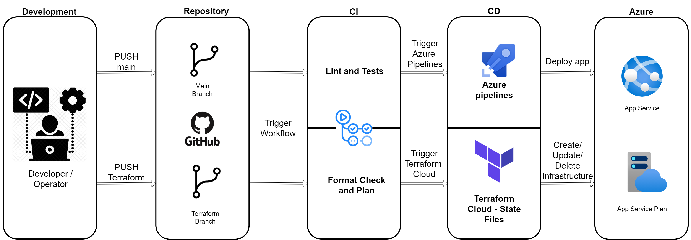
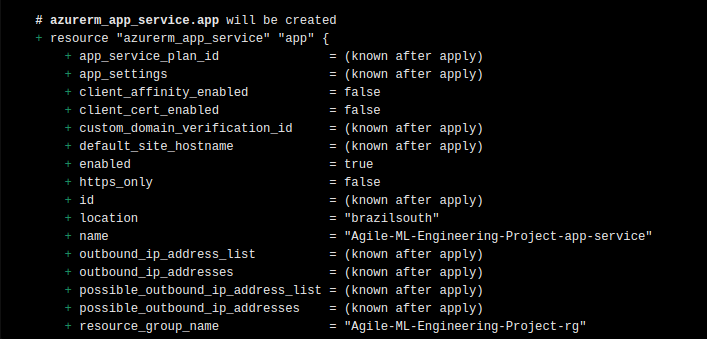
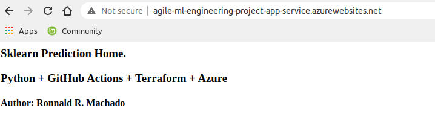
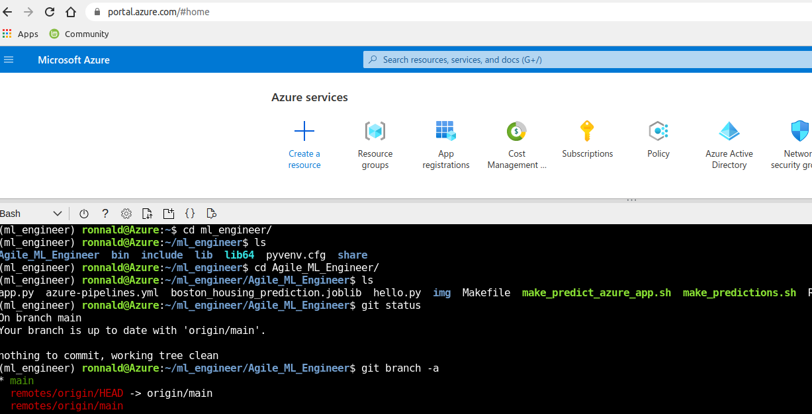
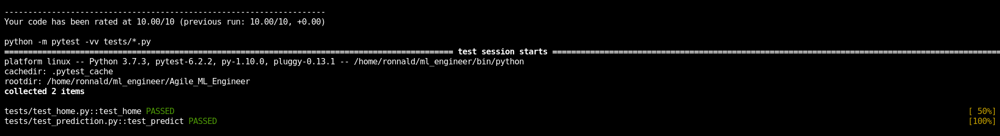
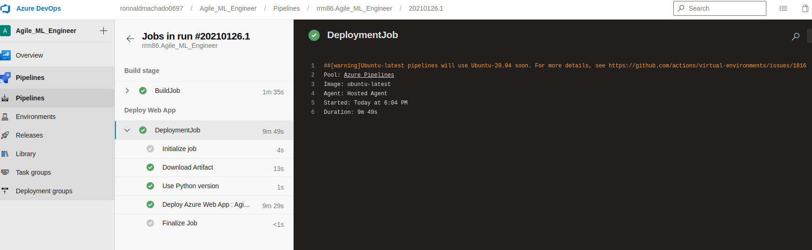
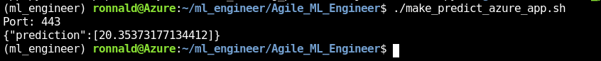
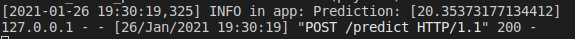
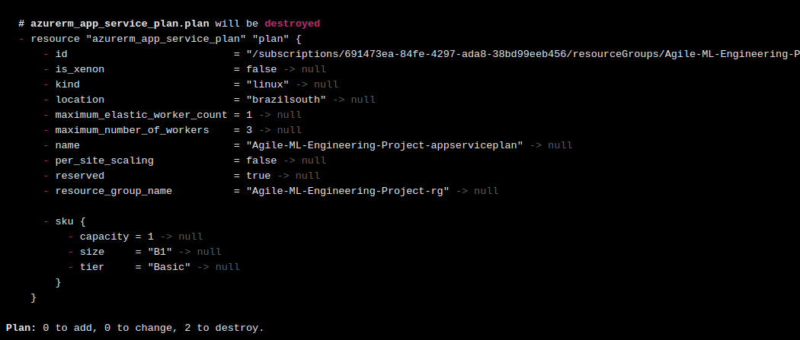

[](https://dev.azure.com/ronnaldmachado0697/Agile_ML_Engineer/_build/latest?definitionId=3&branchName=main)
# Overview

A data science team built a model using scikit learn and exported a [joblib file](https://scikit-learn.org/stable/modules/model_persistence.html). They wish to share the prediction functions with the world through an API.

In this project, I implemented a Microservice strategy using flask and Azure web app to deliver an MVP.

Designed to be the single source of truth this repo has the code of the application and the code to build the infrastructure.

For application, I implemented a full CI/CD cycle using Github Actions (CI) and Azure DevOps (CD). 

- [Check my Github actions](https://github.com/rrm86/Agile_ML_Engineer/actions)
- [Check my Azure Pipeline](https://dev.azure.com/ronnaldmachado0697/Agile_ML_Engineer/_build)

For infrastructure provisioning, I use terraform. A full CI/CD cycle was implemented using Github Actions(CI) and Terraform Cloud(CD).

The application code is in the main branch and the terraform code in the terraform branch.





## Project Plan

Agile Planning using spreadsheet and tickets.

* [My Trello Board](https://trello.com/b/nW0gCtrh/ml-engineer-project-management)
* [Project Management Spreadsheet](https://docs.google.com/spreadsheets/d/1dRuGp9mv1GS10t1vNzEBxuM7Wo3qXMUFMJQdX5cRaOU/edit?usp=sharing)

## Instructions
### Prerequisites & Setup
#### Appication Code
The Code is written in Python 3.7 . If you don't have Python installed you can find it [here](https://www.python.org/downloads/). 
 
 * Create a virtual environment
 ```bash
 $ python3 -m venv <project-name>
 ```
And inside the project folder run:
```bash
 $ source bin/activate
 ```
 Once your virtual environment is ready, you can go to the project root folder and run:
 ```bash
 $ pip install -r requirements.txt
```
Or run:
 ```bash
 $ make install
```
#### Insfrastructure Code
The Code is written in Terraform 0.14 . If you don't have Terraform installed you can find it [here](https://www.terraform.io/downloads.html).

This project runs terraform with [terraform cloud](https://www.terraform.io/docs/language/settings/backends/remote.html) as backend. 
To run locally go to the terraform folder(terraform branch) and comment the block terraform on main.tf file.

#### Azure
* Azure account
* [Azure CLI](https://docs.microsoft.com/pt-br/cli/azure/install-azure-cli)
To authentic into azure cloud run and follow the instructions:
```bash 
$ az login
```
- To check your account run:
```bash 
$ az account list
```
 - In order to perform changes on the azure subscription you need to create an Active Directory service principal account.
```bash
$ az ad sp create-for-rbac --skip-assignment
{
  "appId": "aaaaaaaa-aaaa-aaaa-aaaa-aaaaaaaaaaaa",
  "displayName": "azure-cli-20**-**-**-**-**-**",
  "name": "http://azure-cli-20**-**-**-**-**-**",
  "password": "aaaaaaaa-aaaa-aaaa-aaaa-aaaaaaaaaaaa",
  "tenant": "aaaaaaaa-aaaa-aaaa-aaaa-aaaaaaaaaaaa"
}
```
Copy the output. You'll be prompt to input this values when run terraform init/plan if you run locally!
For terraform cloud backend, configure key->value on UI.
For connection configurations between github actions and Terraform cloud check [this link](https://learn.hashicorp.com/tutorials/terraform/github-actions).

- Create a resouce group for the project:
```bash
$ az group create --name Agile-ML-Engineering-Project-rg --location 'Your Region'
```
- [Configure](https://docs.microsoft.com/en-us/azure/devops/pipelines/ecosystems/python-webapp?view=azure-devops) Azure devops with github.

### Execution

#### Locally
To run the flask application locally, go to the root folder and run:
```bash
$ python app.py
```
You can go to 0.0.0.0:5000 and see the home application.
To test prediction run

You can test the prediciont running:
```bash
$ chmod +x make_predictons.sh
$ ./make_predictions.sh
```
#### Cloud
Running Terraform Locally
* Build Cloud Infrastructure
  * Switch to the terraform branch and go to the terraform folder
  * Run: ``` $ terraform init ```
  * Run: ``` $ terraform plan ```
  * Run: ``` $ terraform apply ```

Running Terraform Cloud
  * Go to your workspace and queue a plan or send a commit to the branch terraform
  

To deploy the application on the new infrastructure, you can trigger the azure pipeline or send a push for the main branch.


You can test the prediciont running on Azure:
```bash
$ chmod +x make_predict_azure_app.sh
$ ./make_predict_azure_app.sh
```
or going to https://your-project-name.azurewebsites.net
#### 

## Screenshots:

* Project up and running


* Project cloned into Azure Cloud Shell


* Passing tests after running the `make all` command from the `Makefile`


* Successful deploy of the project in Azure Pipelines.  .

* Running Azure App Service from Azure Pipelines automatic deployment


* Successful prediction from deployed flask app in Azure Cloud Shell. 



* Output of streamed log files from deployed application


After finish your job you can destroy your infrastructure running:
```bash
$ terraform destroy
```

> 

## Enhancements

<TODO: A short description of how to improve the project in the future>
Also I created a virtualization branch with scaffolding to running the application on docker or kubernets.

## Demo 

<TODO: Add link Screencast on YouTube>